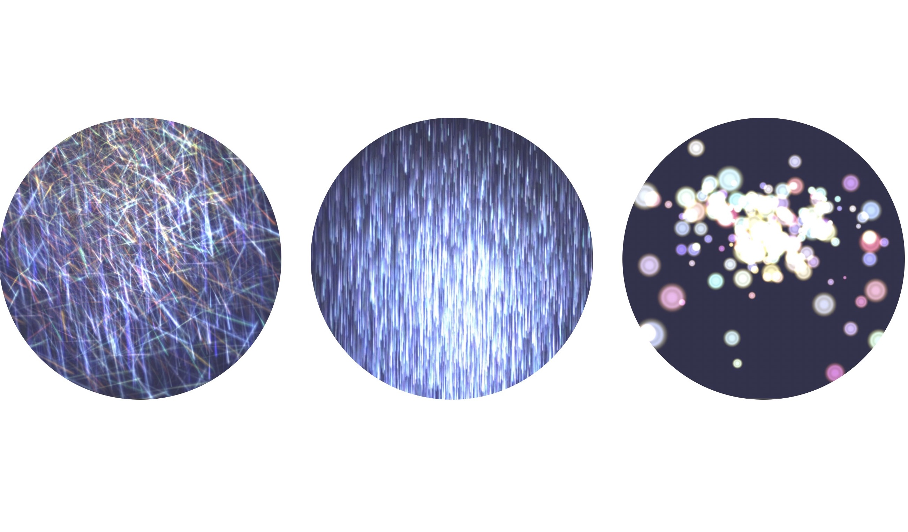

# bjs_effects

  

# Background

The repo shows three particle example with Babylon.js particle editor.  

# Feature

## Shiny rain  

```js
//shiny rain effect
var shinyRainParticle ={json format data};
var shinyRainParticleSystem = ParticleSystem.Parse(shinyRainParticle, scene, "",false);
var particleSource = new AbstractMesh("particleSource", scene);
particleSource.position = new Vector3(0, 0, 0);
shinyRainParticleSystem.emitter = particleSource;
```
## Fireworks  

```js
var fireworkParticle ={json format data};
var fireworksParticleSystem = new ParticleSystem.Parse(fireworksParticle,scene,"",false);
var fireworksParticleSource = new AbstractMesh("fireworksParticleSource", scene);
fireworksParticleSource.position = new Vector3(0,3,0);
fireworksParticleSystem.emitter = fireworksParticleSource;
fireworksParticleSystem.beginAnimationOnStart=false;
fireworksParticleSystem.beginAnimationLoop=true;
fireworksParticleSystem.targetStopDuration=1;
var lineParticle={json formt data};
var lineParticleySystem = ParticleSystem.Parse(lineParticle,scene,"",false);
var lineParticleSource = new AbstractMesh("lineParticleSource", scene);
lineParticleSource.position = new Vector3(0,0,0);

lineParticleySystem.beginAnimationOnStart=true;
lineParticleySystem.beginAnimationLoop =true;
lineParticleySystem.targetStopDuration=1;
lineParticleySystem.emitter = lineParticleSource;
lineParticleySystem.start();

lineParticleySystem.onAnimationEnd= function(){
    console.log("line particle ended!");
    fireworksParticleSystem.start();
}
```

## shiny line sphere

```js
var shinyLineSphereParticle ={json format data}:
var shinyLineSphereParticleSystem = new ParticleSystem.Parse(shinyLineSphereParticle, scene, "",false);
var shinyLineSphereParticleSource = new AbstractMesh("particleSource", scene);
shinyLineSphereParticleSource.position = new Vector3(0, 0, 0);
shinyLineSphereParticleSystem.emitter = shinyLineSphereParticleSource;
```

# Usage

1. npm install  

```bash
npm install webpack webpack-cli webpack-dev-server
npm 
```

2. run webpack-dev-server

```bash
$ npx webpack-dev-server
```

3. Access the URL

http://localhost:3000